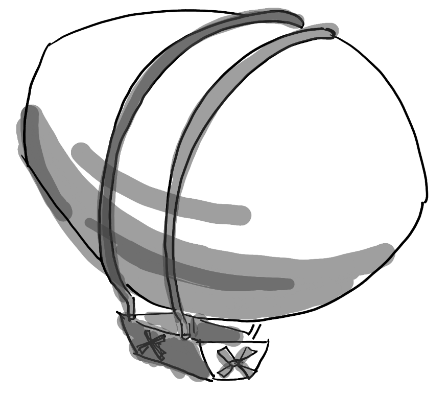

# Aerial Vehicle Types and Categories

Usually, people tend to think about quadcopters when talking about aerial robotics, but there is actually a much larger variety of vehicle types available! Here's an attempt to list all of them if we can.

## Copters

Copters are aerial vehicles that use motors and propellers for their lift and maneuverability in 3D space.

These usually are categorized into the following subcategories:

* **Quadcopters:** The most common aerial vehicle used. It is driven by (as the name already indicates) 4 propellers and 4 motors.
* **Helicopters:** Like manned helicopters, unmanned helicopters are driven by one main rotor on top and one smaller one on the side for stability and maneuverability.
* **Hexacopters/Octocopters:** Copters with 6 or 8 rotors/motor combinations, respectively.
* **Tilt-Rotor Copters:** Copters that have motor and rotor combos that can change orientation.
* **Monocopters:** Monocopters are copters that are only driven by a single rotor and motor combo.

## Fixed Wing

Fixed-wing aerial vehicles use fixed wings for takeoff lift and control.

These are the subcategories:

* **Regular Fixed Wings:** Like regular airplanes, fixed-wing UAVs have 2 wings with a form of propulsion.
* **Hybrid / VTOL:** These vehicles can take off like a quadcopter vertically but can transition and act like a fixed-wing vehicle for the remainder of the flight.
* **Gliding UAVs:** These are fixed-wing UAVs without any propulsion and are therefore reliant on wind and thermal currents.

## Flapping Wing

Flapping-wing aerial vehicles generate both lift and thrust by their flapping wings. 

There are two main subcategories:

* **Ornithopters:** These are the traditional bird-like flapping-wing UAVs. The flapping wings generate lift and thrust and an airplane-like tail with traditional control surfaces is used for stbility and flight control. Some minimal forward velocity needs to be maintained such the wings produce sufficient lift. Only some smaller vehicles demonstrate limited VTOL and hovering capability. These vehicles can be passively stabilized by the tail surfaces and do not require active stabilization, similar to fixed-wing UAVs.
* **Tail-less flapping-wing UAVs:** These vehicles fly like insects and hummingbirds - they can hover, take-off and land vertically, and fly in any direction (forward & backward, sideways, up & down). Lift/thrust is generated by the flapping wings, whose geometry and/or motion is adjustable for flight control. Like multicopters, these vehicles require active stabilization, typically by using an onboard IMU.

## Blimps

Blimps or airships can also be used as aerial vehicles as well. These vehicles stay buoyant by using a balloon with lighter-than-air gas. Maneuverability is either done with flapping wings or rotors.

## List to support vehicles per autopilot suite

Each autopilot suite have their a wide range of supported vehicles, to which this itemized list is referenced to. Note that these lists also include non-aerial vehicles as well.

* [Ardupilot supported vehicle types](https://ardupilot.org/ardupilot/docs/common-all-vehicle-types.html)
* [Paparazzi](https://wiki.paparazziuav.org/wiki/Airframes)
* [PX4](https://docs.px4.io/master/en/airframes/airframe_reference.html)

--8<-- "docs/goatcounter.html"
